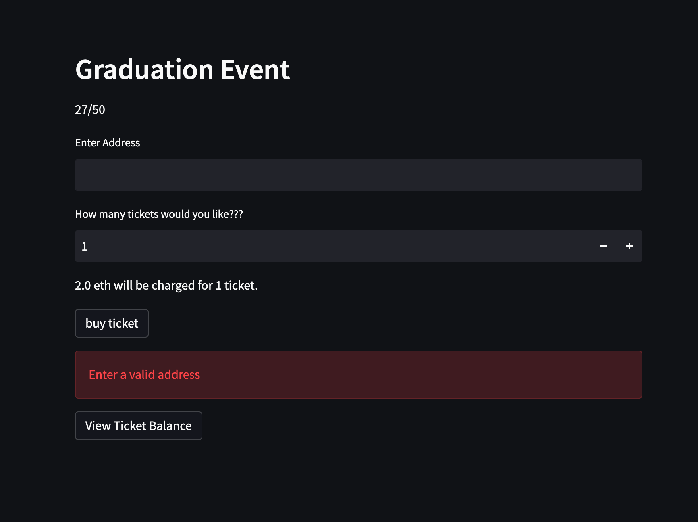
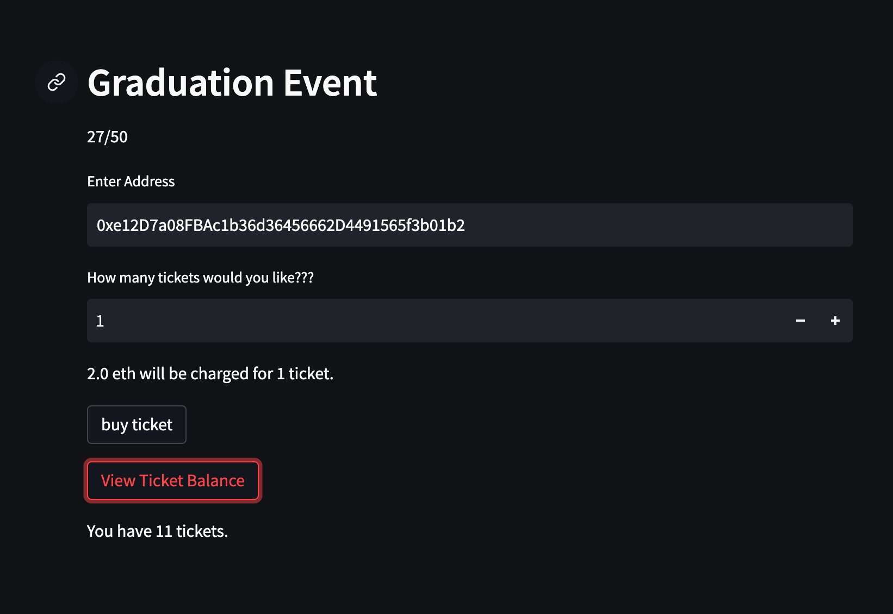

# ETH_Ticketing_v1
> ERC-720 contract for ticketed events
* [What does the applicaiton look like???](#the-application)

---

## Technologies

Python version 3.9 
Solidity version ^0.8.0
* [streamlit](https://streamlit.io/)
* [web3](https://web3py.readthedocs.io/en/stable/)

---

## Installation Guide

```python
pip install streamlit
pip install web3
```

---

## The Application



The user will have to enter a address for any of the functions to work.



The user will be able to purchase and view how many tickets they have in there wallet.
